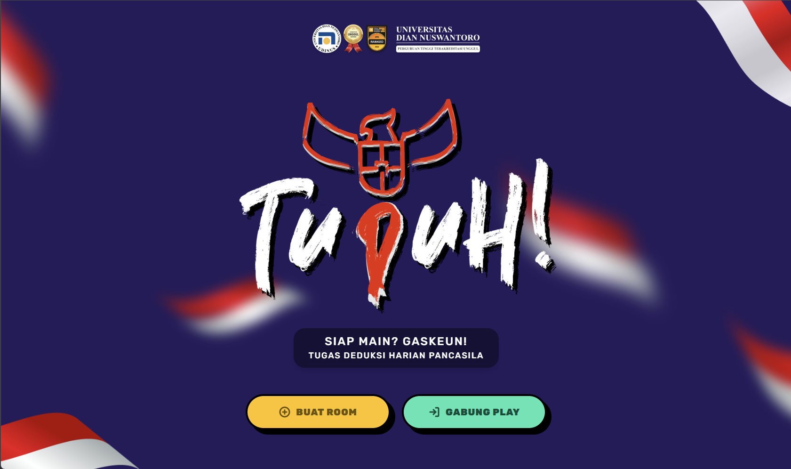

# 🚀 Among Us: Edisi Pancasila

Game edukasi multiplayer interaktif yang menggabungkan keseruan mekanik _social deduction_ ala "Among Us" dengan pembelajaran nilai-nilai luhur Pancasila. Dibangun dengan gaya visual **Neo-Pop** yang mencolok, game ini dirancang khusus untuk membuat sesi belajar di kelas menjadi mendebarkan, kompetitif, dan penuh musyawarah.



---

## 🎮 Konsep Permainan

Pemain bergabung ke dalam sebuah _Room_ (Lobi) yang dikontrol oleh seorang **Guru (Admin)**. Pemain dibagi menjadi dua peran rahasia: **Warga** dan **Provokator**.

- **Warga (Citizen):** Menyelesaikan misi di _Mission Book_ — berupa **kuis Pancasila** dan **mini-game interaktif** — untuk mencapai target _Team Mission_. Warga juga harus mengidentifikasi Provokator melalui musyawarah.
- **Provokator (Impostor):** Menggagalkan misi Warga lewat _Duel_ dan _Sabotase_. Provokator menang jika:
  - Semua Warga tereliminasi, **atau**
  - Jumlah Warga tersisa **≤** jumlah Provokator (kondisi parity), **atau**
  - Waktu permainan habis sebelum misi selesai, **atau**
  - Sabotase gagal diatasi tepat waktu.
- **Guru (Moderator):** _Game Master_ dengan akses ke Control Panel — mengawasi pemain, mengatur timer, memicu debat, presentasi acak, dan mengelola bank soal. Pemain dibatasi maksimal **15 orang** per sesi.

---

## ⚡ Fitur & Mekanik Utama

### 1. 📖 Mission Book (Tugas Warga)

Setiap Warga memiliki _Mission Book_ interaktif dengan batas waktu **15 detik per misi**. Misi bisa berupa:

| Tipe                  | Deskripsi                              |
| --------------------- | -------------------------------------- |
| **📝 Kuis Pancasila** | Soal pilihan ganda dari bank soal Guru |
| **🎮 Mini-Game**      | Game interaktif bertema Sila 2–5       |

Guru dapat mengatur porsi kuis vs mini-game di **Pengaturan Game** (default: 40% kuis, 60% mini-game). Menyelesaikan misi dengan benar menambah progres _Team Mission_ (+1 skor pribadi).

**Mini-game yang tersedia:**

| Mini-Game          | Sila | Mekanik                                     |
| ------------------ | ---- | ------------------------------------------- |
| Hubungkan Kebaikan | 2    | Sambung simbol kebaikan ↔ nilai kemanusiaan |
| Dekripsi Pesan     | 3    | Dekripsi sandi Caesar → "BHINNEKA"          |
| Urutan Mufakat     | 4    | Urutkan tahapan musyawarah                  |
| Timbangan Keadilan | 5    | Balance logistik antar-wilayah              |

### 2. 🚨 Sabotase (Aksi Provokator)

Provokator memicu sabotase dalam **2 fase**:

1. **Fase Provokator** — Provokator menjawab soal math kilat (15 detik) untuk mengaktifkan sabotase.
2. **Fase Rescue** — Layar Warga terkunci. Satu Warga dipilih acak sebagai pahlawan rescue dan harus menjawab soal Pancasila dalam batas waktu. Jika gagal, Provokator menang!

### 3. ⚔️ Duel 1v1 (Sudden Death)

Provokator menantang satu Warga hidup. Keduanya berebut menjawab soal Pancasila:

- Siapa yang **pertama menjawab benar** memenangkan duel. Jika Provokator menang, Warga target tereliminasi dan _Emergency Meeting_ dipicu. Jika Warga menang, Provokator TIDAK tereliminasi (hanya bisa melalui voting).
- Jawaban **salah** → waktu duel **berkurang 5 detik** dan soal diganti.
- Timer habis → duel seri, tidak ada eliminasi.
- Cooldown **15 detik** setelah duel untuk Provokator.

### 4. 📢 Musyawarah Kelas (Voting)

Guru dapat menghentikan permainan untuk sesi musyawarah. Selama debat voting, **timer permainan utama di-pause**. Pemain berdiskusi (lisan di kelas) lalu melakukan _voting_ di layar. Mayoritas suara mengeliminasi satu pemain.

_Emergency Meeting_ juga otomatis dipicu setelah Warga tereliminasi lewat duel.

### 5. 🎤 Presentasi Acak

Guru memicu _Random Presentation_ — satu pemain dipilih acak untuk presentasi. Pemain lain melihat notifikasi siapa yang sedang berbicara.

### 6. 💬 Debat Topik Bebas

Guru melempar topik diskusi kustom ke seluruh layar (misal: _"Apakah gotong royong luntur di era digital?"_). Mode _Topic Debate_ berjalan dengan timer hitung mundur; timer permainan utama ikut di-pause.

### 7. 📊 Fitur Tambahan

- **Bank Soal Kustom** — Guru menambah/edit/hapus soal di lobby
- **Live Stats** — Statistik permainan real-time (bisa disiarkan ke semua pemain)
- **Halaman Stats** (`/stats`) — Ringkasan statistik sesi
- **Ganti Karakter** — 8 skin di lobby sebelum permainan dimulai
- **Pengaturan Game** — Durasi timer, jumlah tugas, porsi kuis/mini-game, jumlah Provokator

---

## 🎨 Gaya Visual (Neo-Pop / Brutalism)

- **Warna kontras tinggi:** Kuning terang, ungu gelap, hijau neon, merah darah
- **Garis tegas:** Border hitam tebal (4px) di hampir seluruh elemen
- **Shadow flat:** `shadow-[6px_6px_0px_#000000]` tanpa blur
- **Tipografi:** Rubik Italic + monospace terminal

---

## 🛠️ Tech Stack

| Layer              | Teknologi                                    |
| ------------------ | -------------------------------------------- |
| Frontend           | [Next.js 14](https://nextjs.org/) & React 18 |
| Styling            | [Tailwind CSS](https://tailwindcss.com/)     |
| Backend & Realtime | Node.js, [Socket.io](https://socket.io/)     |
| Icons              | [Lucide React](https://lucide.dev/)          |

---

## 🚀 Cara Menjalankan Secara Lokal

1. Instal [Node.js](https://nodejs.org/) versi 18+.
2. Clone repository dan masuk ke folder proyek:
   ```bash
   git clone <url-repository-anda>
   cd among-us
   ```
3. Instal dependensi:
   ```bash
   npm install
   ```
4. Jalankan development server:
   ```bash
   npm run dev
   ```
5. Buka `http://localhost:3000` di browser. Gunakan beberapa tab/device untuk uji multiplayer.

**Production:**

```bash
npm run build
npm start
```

---

## 📁 Struktur Direktori Penting

```
src/
 ├── pages/              # Routing: /, /game, /stats
 ├── components/
 │    ├── minigames/     # Mini-game Pancasila (Sila 2–5)
 │    ├── panels/        # WargaPanel, ProvokateurPanel, TaskContainer
 │    ├── game/          # PlayerView, AdminView, GameHeader
 │    └── overlays/      # Duel, Sabotase, Debat, Presentasi
 └── hooks/useSocket.js  # State & listener Socket.io client

server/
 ├── server.js           # Entry point Express + Socket.io
 ├── handlers/           # gameHandler, joinHandler, questionHandler
 ├── data/               # defaults, questions, minigames
 └── lib/                # gameLogic, roomHelpers, mathQuiz
```

Dokumen arsitektur mini-game: [`implementation plan.md`](implementation%20plan.md)

---

## 🧪 Uji Coba Mini-Game

Halaman debug untuk menguji mini-game secara terpisah:

```
http://localhost:3000/debug-kebaikan
```

---

> _"Membangun karakter bangsa tidak pernah semenyenangkan ini."_ 🇮🇩
